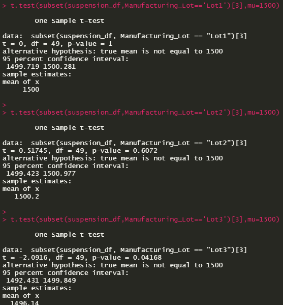

# MechaCar Statistical Analysis

## Overview
___
## Linear Regression to Predict Miles Per Gallon (MPG)
___

As we can see from the above results, the vehicle length and ground clearance variables produced p-values less than 0.05, suggesting that it is very unlikely they contributed random variation to the linear model. In other words, these variables can be considered significant.

However, our Intercept's p-value was also less than 0.05, which suggests that there are other variables, not modeled or included in our original dataset, which also would contribute to influencing overall MPG. This analysis is certainly not exhaustive.

The slope of the linear model is not zero; as the linear model's slope is influenced by all variables in our model, some variables have a coefficient (slope) much larger than 0; vehicle length has a slope of approximately 6.23, while ground clearance has a slope of approximately 3.55. Based off this, we can reject the null hypothesis and assume that ground clearance and vehicle length both have some effect on mpg

The p-value of the overall model is listed as 5.35e-11, suggesting it is a good predictor of mpg as a whole; despite this, we know there are additional factors that influence mpg that are not modeled here.
___
## Summary Statistics on Supsension Coils
___

According to manufacturing requirements proposed, variance of suspension coils must not exceed 100 PSI; as seen in the total summary above, the overall variance across all lots of only 62 PSI, which is under the acceptable limit

When drilling deeper, however, we can see this is largely driven by the variance in Lot 3 of 170 PSI, which suggests some process that is exceeding control limits for manufacturing in this lot specifically.
___
## T-Tests on Suspension Coils
___

As we can see from the results above from the One-Sample t-test, with a p-value of less than 0.05, we cannot reject the null hypothesis and thereby, we can conclude there is no statistically significant difference between the mean PSI of the overall manufacturing process (1500 PSI) and our population's mean PSI (1498.78).

Following the above discovery regarding Lot 3's variance, we can find further evidence that, since the p-value of our t-test **is less than 0.05**, we can conclude that **there is a statistically significant difference between the Lot's mean PSI of 1496.14 PSI and the overall manufacturing process' mean of 1500 PSI.** The remaining lots do not show any significant variance, nor would we expect them to be, given their mean PSI are 1500.00 and 1500.20, respectively.
___
## Study Design: MechaCar vs Competition
___

In order to give the MechaCar a competitive advantage versus other cars in its class, we will look at the effect of installing a stop-start engine versus a traditional, "always-on" engine, on **city-driving fuel mileage (miles per gallon)**.

**Null hypothesis**: MechaCars with a stop-start engine do not enjoy 20% better fuel economy (average miles per gallon) for city driving than those with traditional, always-on engines

**Alternate hypothesis**: MechaCars with a stop-start engine enjoy 20% better fuel economy (average miles per gallon) for city driving than those with traditional, always-on engines

In order to test this, we will require a statistical test which assess the effect of a categorical independent variable on a continuous, dependent variable. In this case, I would perform an analysis of variance, or ANOVA, to test whether a detected variance between the means of the stop-start engine group, and the traditional engine group, is statistically significant.

In this case, we meet all three assumptions to perform an ANOVA:

- Dependent variable is numerical and continuous, and the independent variables are categorical
- Dependent variable is considered to be normally distributed
- Variance among each group should be similar

The data required for this test would be a population dataset of equal numbers of vehicles with traditional engines and stop-start engines, having driven a fixed kilometer distance in an arbitrarily defined "city-environment", hopefully controlled more specifically to account for various factors. This would likely produce a normally distributed dataset with equal variance, to satisfy the assumptions above.

